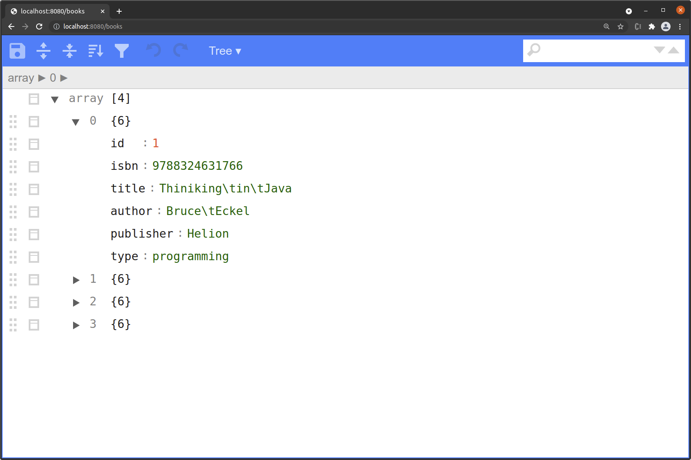
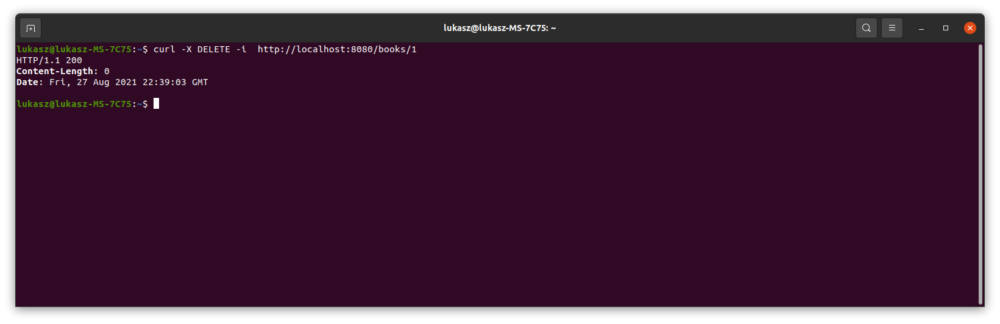
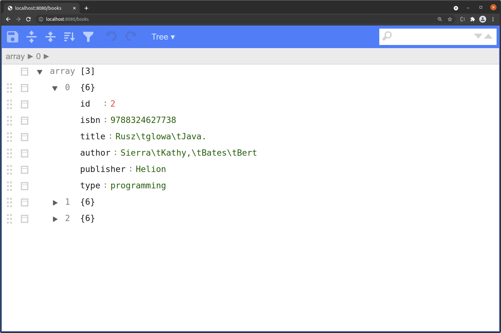

# Spring API BOOK
> It's a beloved writing back-book to the REST Method directory.
> To use the API, I used the MVC spring, Jackson's library, and additional annotations.
> I used the curl program to verify our api.
> The division of the application on the backend and frontend layers is very high quality.
> My API client can be a mobile application, frontend application, or other backend application.

## Technologies Used
- Lombok version 1.18.20
- Spring Framework 5.1.9.RELEASE

## Screenshots (operation DELETE)

## Usage
>**In the command.txt file, there are sample commands for the job program command file.
Commands must be performed in the terminal**.

## Project Status
Project is: complete.

